# CartMode

## Arquitecturas de Software (ARSW) 
## 2019-1 
## Escuela Colombiana de Ingeniería Julio Garavito - Ingeniería de Sistemas
#### Juego educativo, competitivo y a su vez de entretenimiento tipo seleccion de parejas que pretende poner a prueba las hablidades cognitivas de los usuarios, complementandolo con preguntas sencillas de matematicas..
---
### Integrante
- Cesar E. Lanos Camacho
### Profesor
- David Saavedra
---
### :link: URLs
| Elemento | Link |
|:-------------------------------------:|:----------------------------------------------------------------------------------------------------:|
| Propuesta de proyecto | https://docs.google.com/document/d/1ynF7FltaMq4Is_eI6oozmRWI5bi-lQrzWnHo84oVVRc/edit?usp=sharing  |
| Taiga | https://tree.taiga.io/project/cefarr-cartmode/timeline  |  
| NinjaMock | https://ninjamock.com/s/V5J5CSx  | 
| Javadoc | Generado en la ruta ./target/site/apidocs |
| Documento de Arquitectura del Sistema | https://drive.google.com/file/d/1Q7eTkRk0ZuE1sClnu6SufcEVbkiP3maU/view?usp=sharing | 
| Servidor 1 | http://34.74.211.162:8080/ | 
| Servidor 2 | http://34.73.143.202:8080/ | 
| Balanceador de Carga | http://35.211.240.94:8080/ | 
---
### :book: Instrucciones
Proximamente

---

### :camera: Pantallas de la aplicación-- Pruebas Funcionales.

### :book: Requisitos Funcionales

- El jugador inicia la aplicacion e ingresa a la pagina de bienvenida.

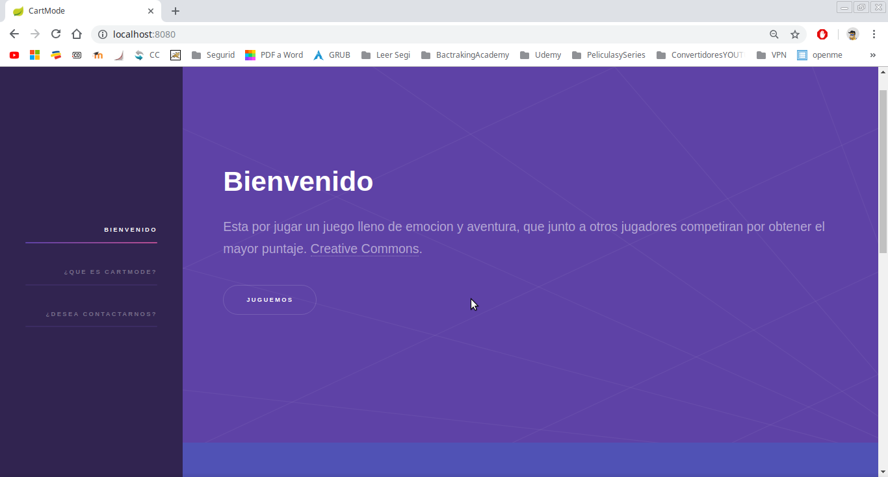

---

- El jugador se conecta y queda registrado en una sala unica.(De ser el primero queda como anfitrion).

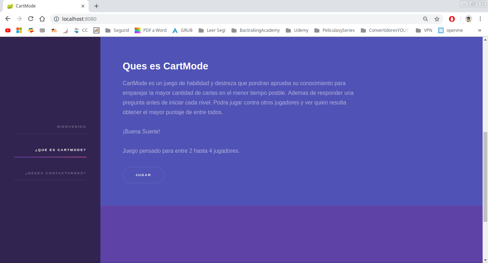

---

- Cada jugador puede conocer tanto su anfitrion como los demas participantes de su partida.

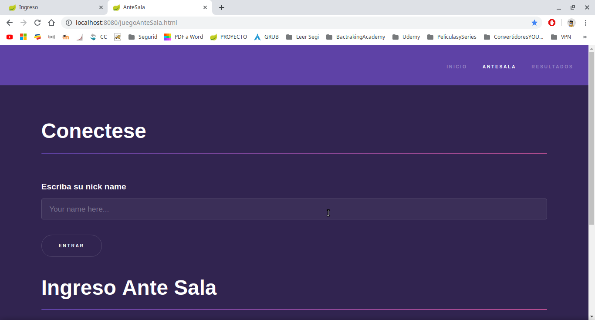

---

-Como se observa Cesar ingreso a la sala de juego.
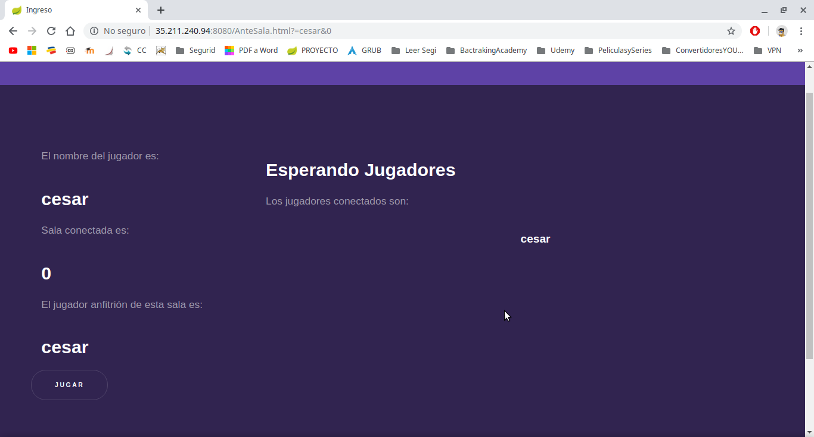

---
- El Anfitrion no puede iniciar la partida ya que no hay suficientes jugadores conectados.
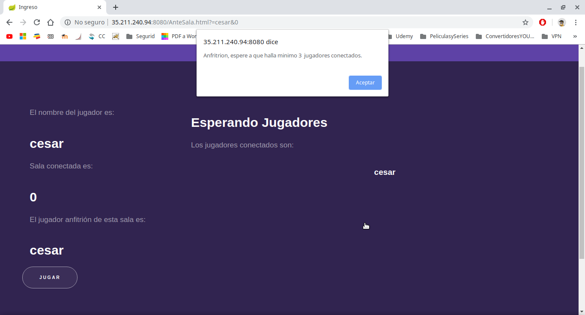

---

- Ingreso Leonado pero el jugador Anfitrion es el unico que puede iniciar la partida (Cesar).

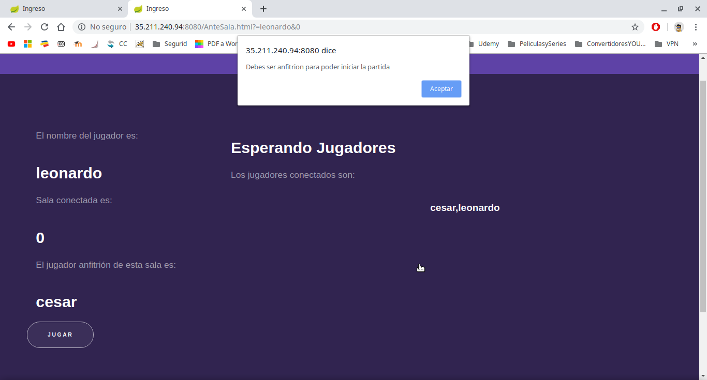

---
-Como se observa Leonardo y Pepita han ingresado a la sala de juego.
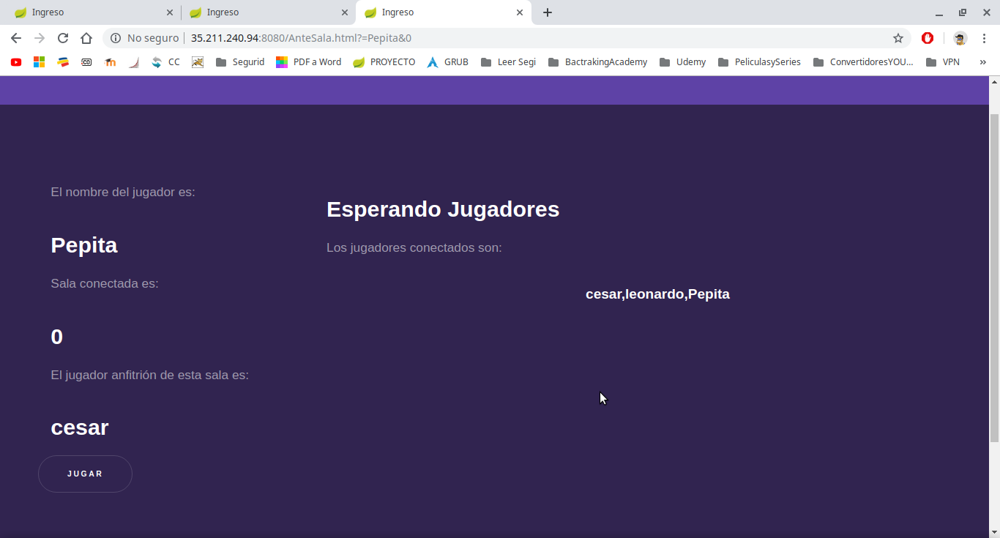

---

-Ya se completaron los jugadores minimos, y el Anfitrion inicia la partida.
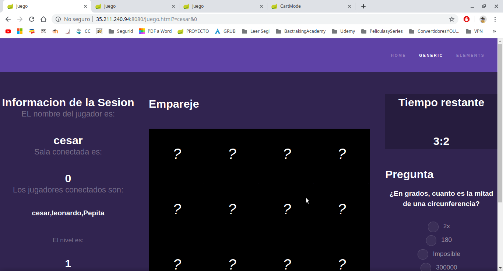

---

-Los jugadores comienzan a jugar y se evidencia el Stomp funcionando. Ademas se 
puede apreciar que cada jugador tiene su propio color caracteristico.

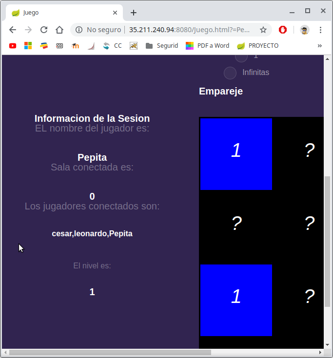
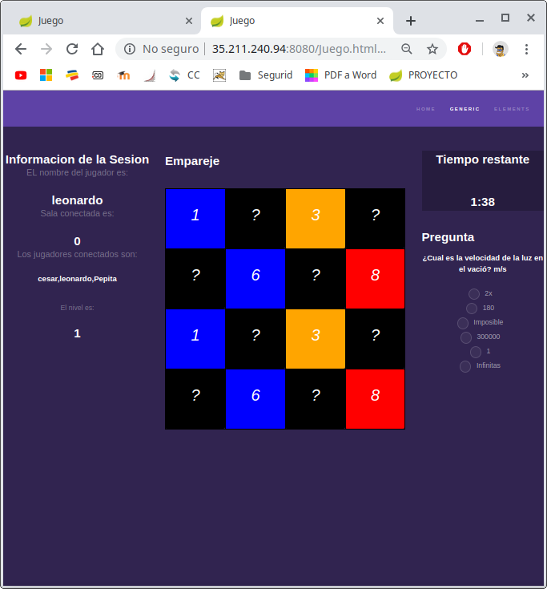

---

-Otro usuario se conecta pero ya no hace parte de la sala anteriormente creada, 
    es agregado a una nueva sala.

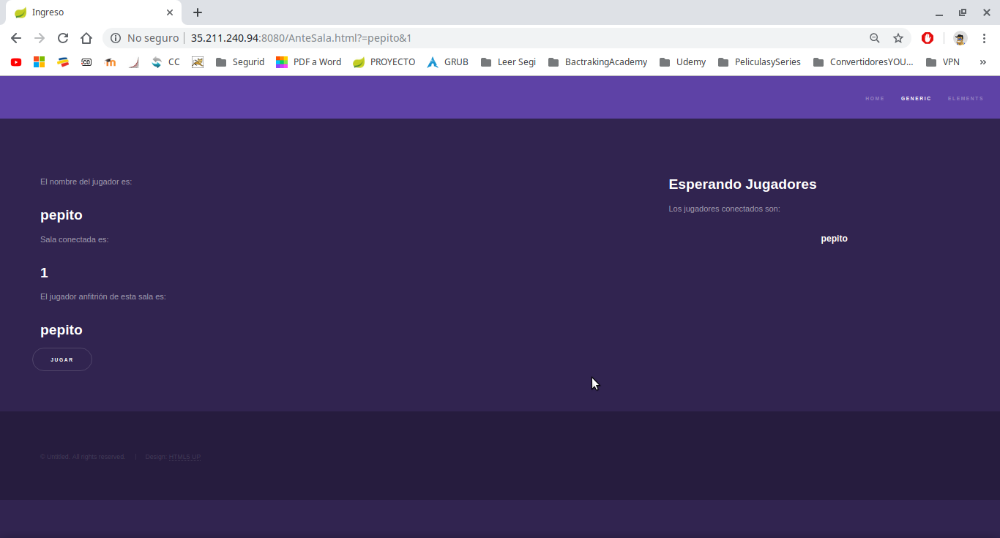

---

- Despues los jugadores pueden ver sus resultador de manera ordenada.

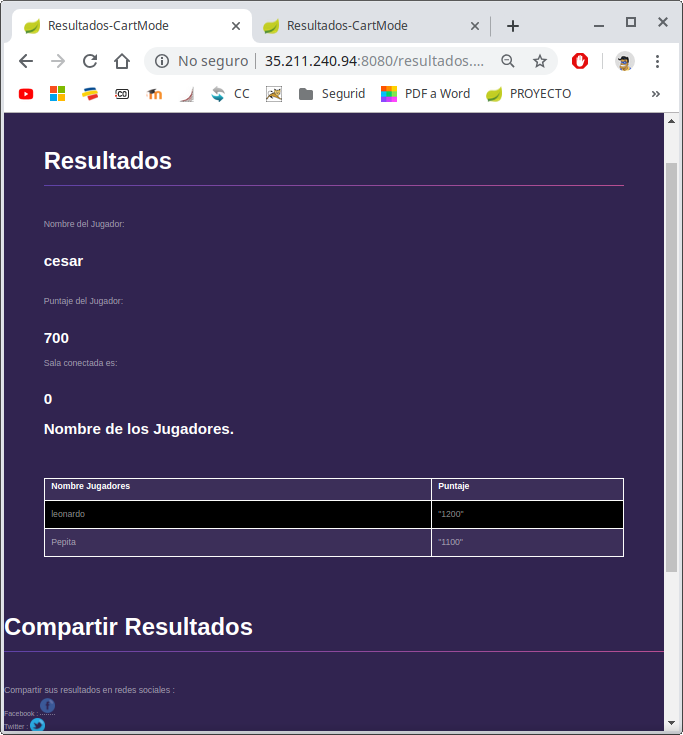

---

- Los jugadores o cualquier usuario podra consultar el historial de los mejores
  puntajes en cartMode de manera ordenada.

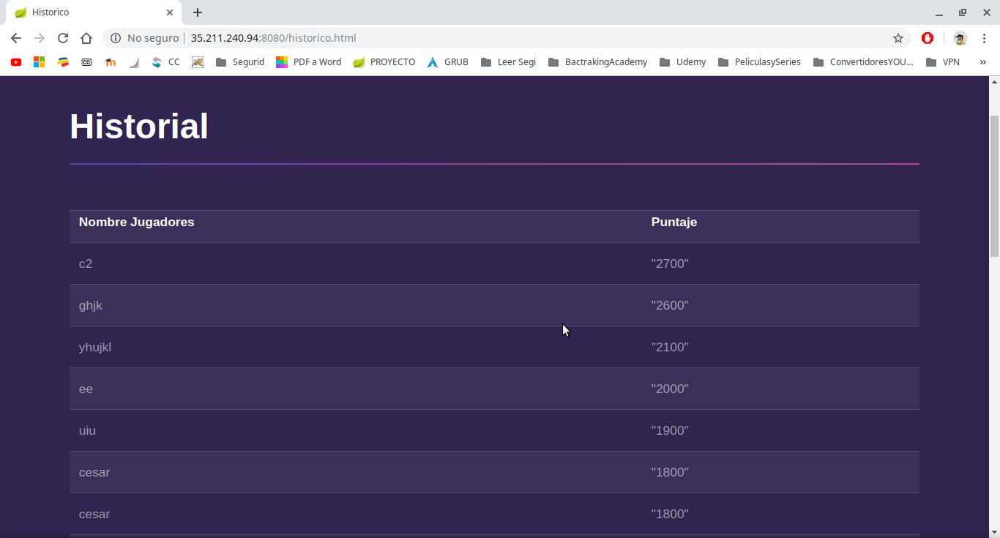

---

- Proximamente

---

- Pruebas con Postman
Proximamente

---

- Proximamente

---

---

---

---

---

### :triangular_ruler: Diseño de arquitectura 
#### - Paquetes
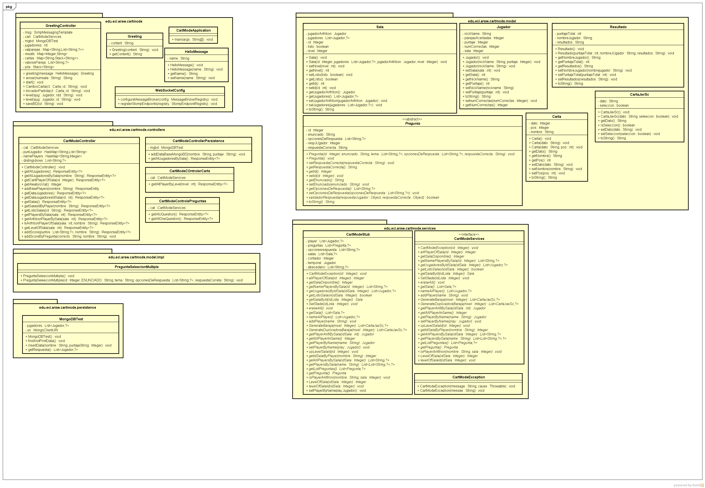
#### - Clases

#### - Paquete Detalle 1
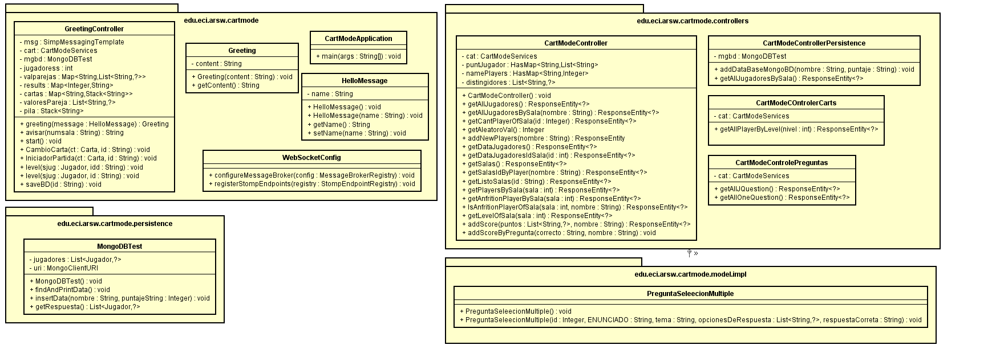
#### - Paquete Detalle 2
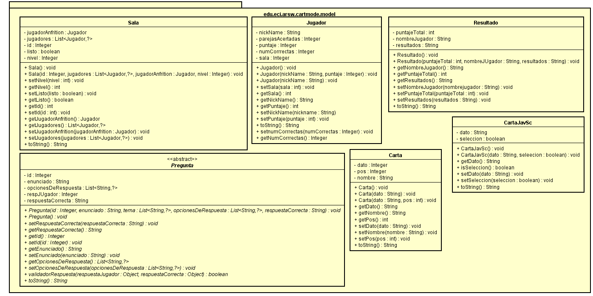
#### - Paquete Detalle 3
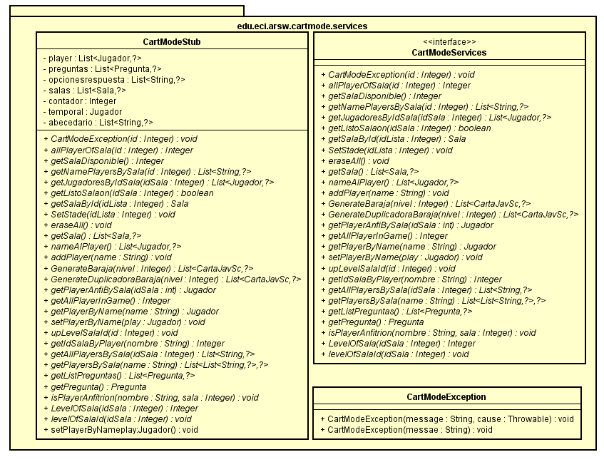
#### - Componente Conector
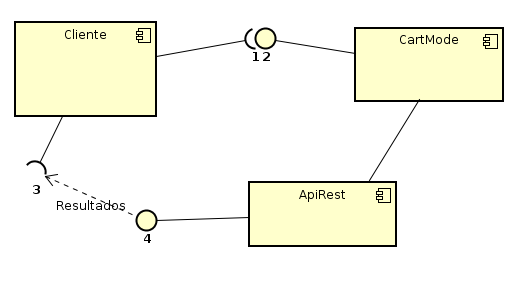
#### - Interaccion Stomp
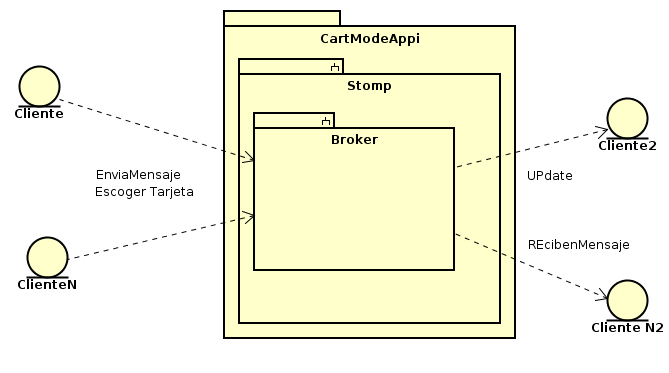
#### - Diagrama de Despliege
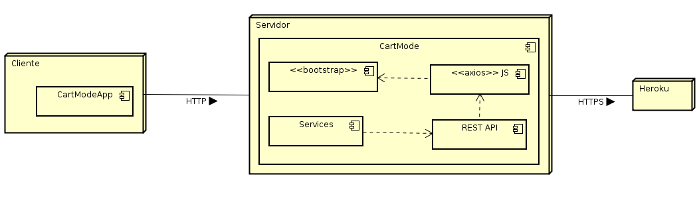

---
### :wrench: Tecnologías utilizadas

---
### Licencia
[MIT]()
