# CartMode

## Arquitecturas de Software (ARSW) 
## 2019-1 
## Escuela Colombiana de Ingeniería Julio Garavito - Ingeniería de Sistemas
#### Juego educativo, competitivo y a su vez de entretenimiento tipo seleccion de parejas que pretende poner a prueba las hablidades cognitivas de los usuarios, complementandolo con preguntas sencillas de matematicas..
---
### Integrante
- Cesar E. Lanos Camacho
### Profesor
- David Saavedra
---
### :link: URLs
| Elemento | Link |
|:-------------------------------------:|:----------------------------------------------------------------------------------------------------:|
| Propuesta de proyecto | https://docs.google.com/document/d/1ynF7FltaMq4Is_eI6oozmRWI5bi-lQrzWnHo84oVVRc/edit?usp=sharing  |
| Taiga | https://tree.taiga.io/project/cefarr-cartmode/timeline  |  
| NinjaMock | https://ninjamock.com/s/V5J5CSx  | 
| Javadoc | Generado en la ruta ./target/site/apidocs |
| Documento de Arquitectura del Sistema | https://drive.google.com/file/d/1Q7eTkRk0ZuE1sClnu6SufcEVbkiP3maU/view?usp=sharing | 
| Servidor 1 | http://35.229.25.251:8080/ | 
| Servidor 2 | http://34.74.198.173:8080/ | 
| Balanceador de Carga | http://35.211.240.94:8080/ | 
---
### :book: Instrucciones

Bienvenido a CartMode

Ahora usted esta a frente a un juego lleno de habilidad y respuesta cognitiva, 
donde usted y otros participantes jugaran por obtener el mayor puntaje posible
emparejando cartas en un tiempo limite, pero recuerda que si no pudiste 
emparejar muchas cartas tienes la opción de responder una sencilla pregunta 
que te dará puntos adicionales. Ahora acompañame que te enseñare como funciona 
CartMode.

Juego hasta para 4 personas.
1. Paso
Cuando entras en el link de la aplicación te va a llevar a una breve descripción 
de que es CartMode, si deseas jugar dale clic en el botón Juguemos, y después 
da clic en el botón jugar.

Te aparecerá la entrada a la aplicación donde debes escribir un nombre de usuario
que te identifique y con el podrás diferenciarte de los demás jugadores durante
la partida.
Ingresa el nombre y dale clic a entrar, esto te llevara a la sala de espera también
llamada antesala.

2.Paso

Aquí si fuiste el primer jugador en entrar a esa sala automáticamente te vuelves
anfitrión de esta y eso significa que solo tu podrás iniciar la partida, pero 
no creas que en cualquier momento, solo hasta que hallan otros dos jugadores conectados 
a esa sala podrás iniciarla. Si no fuiste el primero tendrás que esperar a que estén mínimo 3 
jugadores conectados para que se pueda iniciar la partida.

3. Paso

Una vez hubo los minimos jugadores y el anfitrion halla iniciado la partida, seras
dirigido a la pagina de Juego, donde te aparece en el centro el tablero de cartas,
a tu izquiera tu nombre de usuario y la sala a la cual estas conectado y los demas jugadores
que tambien estan conectados contigo. A tu lado derecho aparecera bien grande el 
tiempo para que lo tengas presente y si quieres responder la pregunta, no es 
obligatorio, pero te podra traer puntos adicionales si la respondes correctamente.

Una vez se acabe el tiempo o las parejas de cartas para realizar, subiras de nivel 
inmediatamente, recuerda que solo hay 3 niveles.¿Quieres que los explique?
Claro, cada nivel consta de :
    ## Nivel 1:
        En el podras encontras un juego de 16 cartas normales del 1 al 8, y para encontrar
        todas las tarjetas tendras 3 minutos y 3 segundos para encontrarlas todas.
    ## Nivel 2
        En este podras encontrar 25 cartas esta vez con numeros y letras y numeros pero ten
        cuidado, hay una carta trampa que no podras emparejar y solo te hara perder
        la oportunidad de sumar puntos. Para este tendras 2 minutos y 3 segundos.
    ## Nivel 3
        En este nivel podras encontrar 20 cartas con numeros y letras y tendras el mismo
        tiempo  para encontrar todas las parejas.

Despues de pasar por los 3 niveles la aplicacion te llevara a la pagina de resultados.
Donde podras observar tu puntaje y tambien el de tus compañeros. Ademas de eso podras 
compartirlo con las redes sociales o si lo deseas descargar tus resultados en un formato pdf.

Si fuiste el mejor puntaje en tu sala te invito a que revises el apartado de historicos, este
lo podras encontrar en el index debajo  del apartado con la pregunta ¿Que es CartMode?.

En el encontraras los mejores puntajes que se han jugado en la aplicacion, y esta ordenado de manera descendente.

Espero te haya sido util esta infomacion y puedas aprovechar al maximo la aplicacion.
¿Sera que seras el ganador de tu partida? o ¿De CartMode?

---

### :camera: Pantallas de la aplicación-- Pruebas Funcionales.

### :book: Requisitos Funcionales

- El jugador inicia la aplicacion e ingresa a la pagina de bienvenida.

---

- El jugador se conecta y queda registrado en una sala unica.(De ser el primero queda como anfitrion).

---

- Cada jugador puede conocer tanto su anfitrion como los demas participantes de su partida.

---

-Como se observa Cesar ingreso a la sala de juego.

---
- El Anfitrion no puede iniciar la partida ya que no hay suficientes jugadores conectados.

---

- Ingreso Leonado pero el jugador Anfitrion es el unico que puede iniciar la partida (Cesar).

---
-Como se observa Leonardo y Pepita han ingresado a la sala de juego.

---

-Ya se completaron los jugadores minimos, y el Anfitrion inicia la partida.

---

-Los jugadores comienzan a jugar y se evidencia el Stomp funcionando. Ademas se 
puede apreciar que cada jugador tiene su propio color caracteristico.

---

-Otro usuario se conecta pero ya no hace parte de la sala anteriormente creada, 
    es agregado a una nueva sala.

---

- Despues los jugadores pueden ver sus resultador de manera ordenada.

---

- Los jugadores o cualquier usuario podra consultar el historial de los mejores
  puntajes en cartMode de manera ordenada.

---

## Pruebas con Postman

---

## CartModeCOntroller

- Obtener todos los nombres de los jugadores de la aplicacion.

---

- Obtener todos los nombres de los jugadores de una sala.

---

- Cantidad de Jugadores en una sala especifica.

---

- Añadiendo un nuevo jugador al juego.

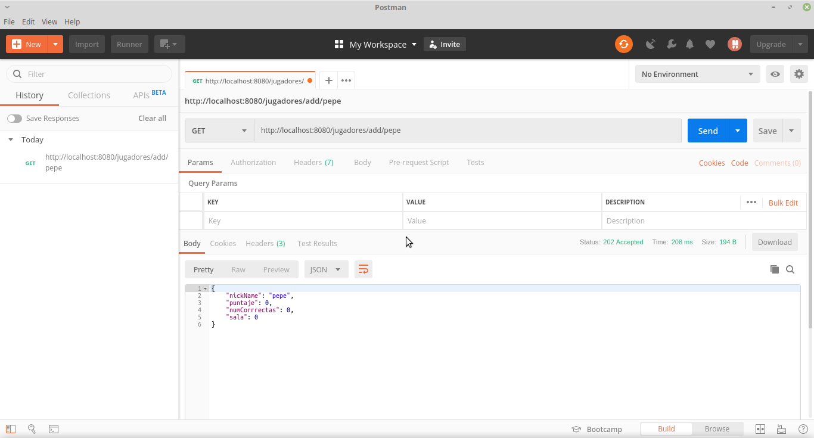

---
- Datos completos sobre todos los jugadores de la aplicacion.

---
- Datos completos sobre todos los jugadores de una sala especifica de 
la aplicacion.

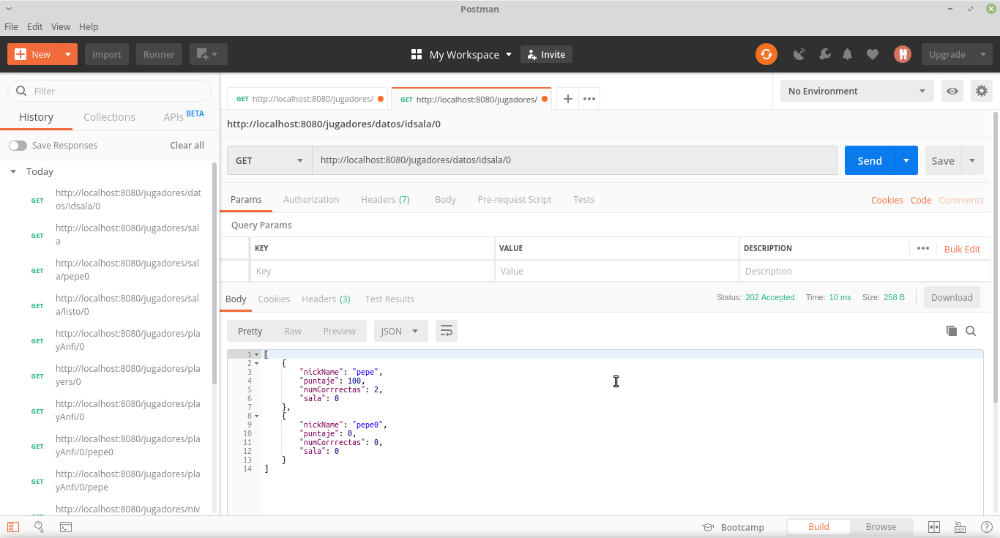

---
- Toda la informacion sobre todas las salas que esten creadas en la aplicacion.
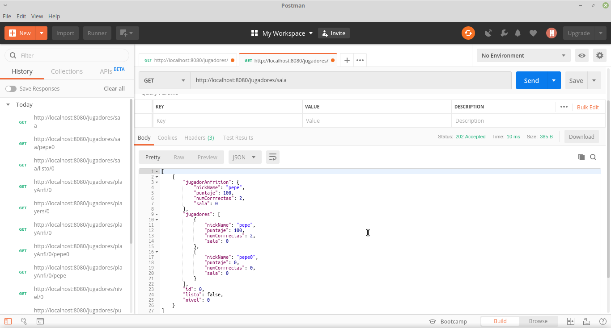

---
- Informacion sobre sala a la cual pertenece un jugador especifico.
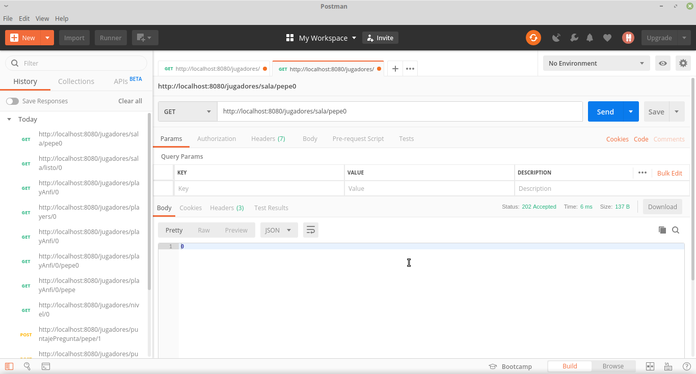

---
- Nos retorna un valor booleano y saber si la sala ya inicio o todavia esta 
en espera.

---
- Retorna todos los nombres de los jugadores de una sala especifica.
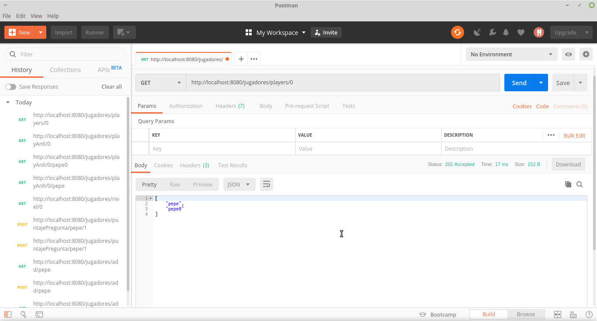

---
- Nos regresa el jugador anfitrion de la sala especificada.
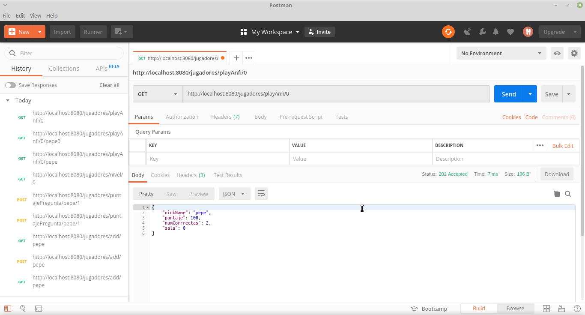

---
- Nos regresa un valor booleano informando si el jugador pasado como 
parametro es o no Anfitrion en su sala.
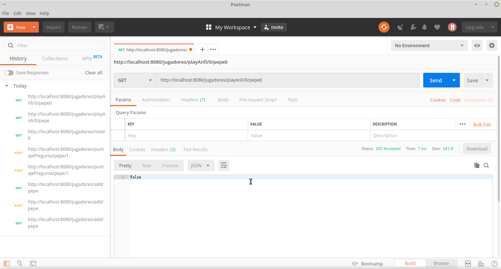

---
- Nos regresa el nivel de la sala especificada.
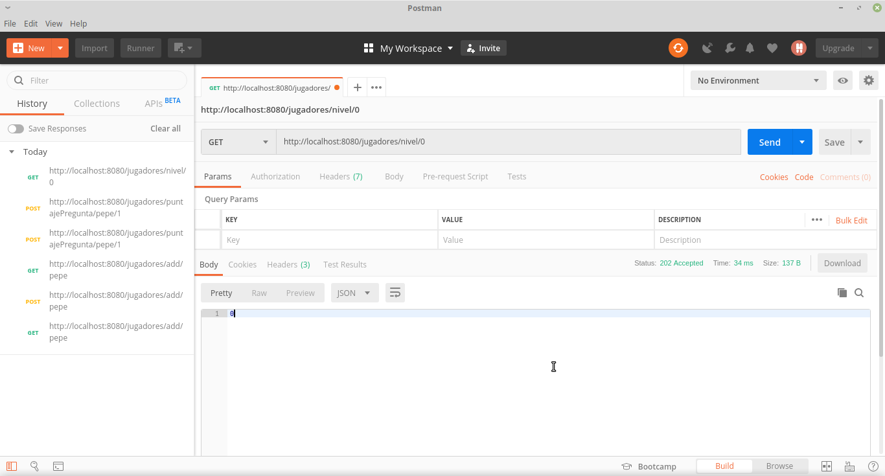

---
- Adiciona un puntaje cuando el jugador responde correctamente una pregunta.
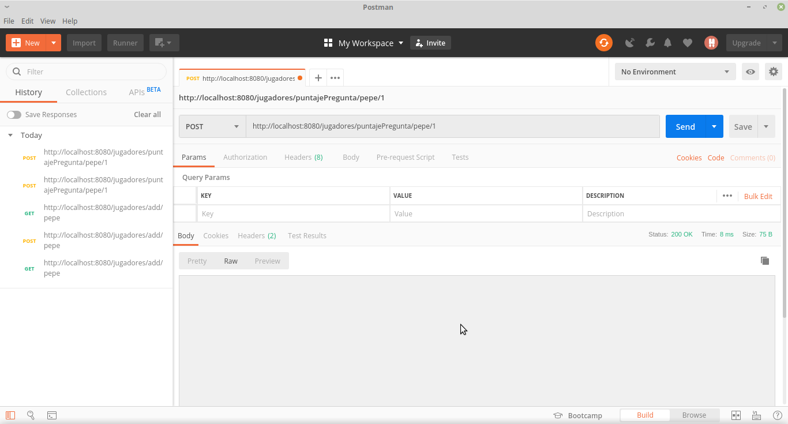

---

## CartMode ControllerPersistence

---
- Adicionar nuevos jugadores a la base de datos.
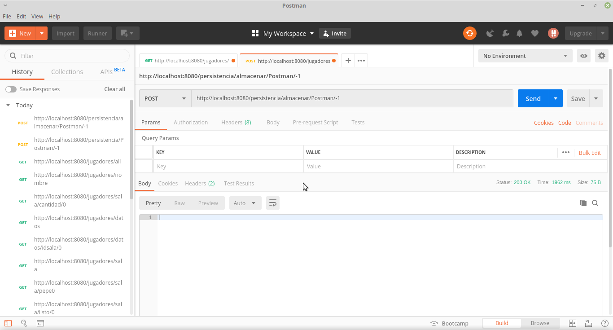

---
- Muestra a todos los jugadores almacenados en la base de datos.
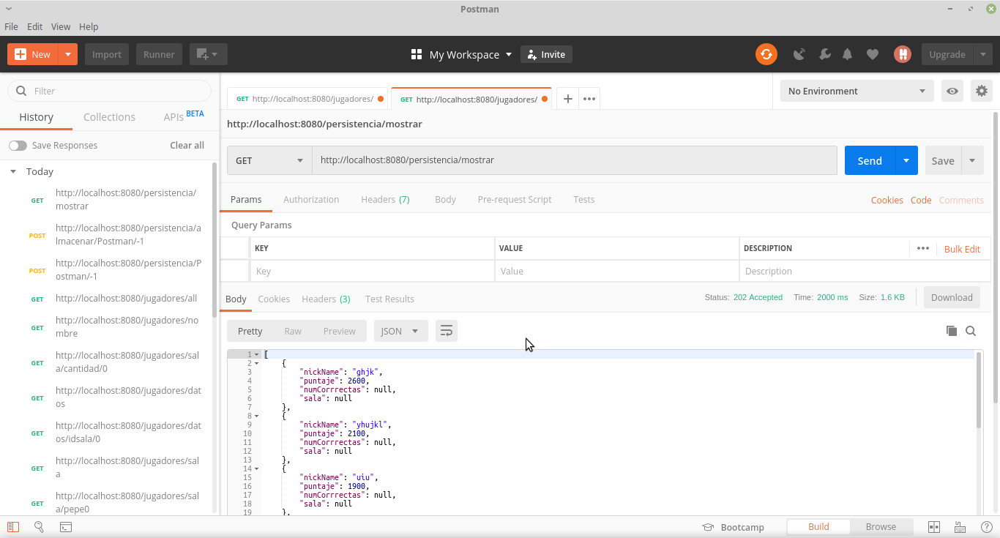
---

## CartMode Controller Preguntas

---
- Nos muestra todas las preguntas del sistema.
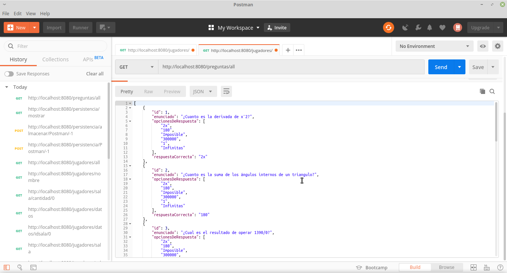

---
- Nos regresa una pregunta aleatoriamente de todas las preguntas del sistema.
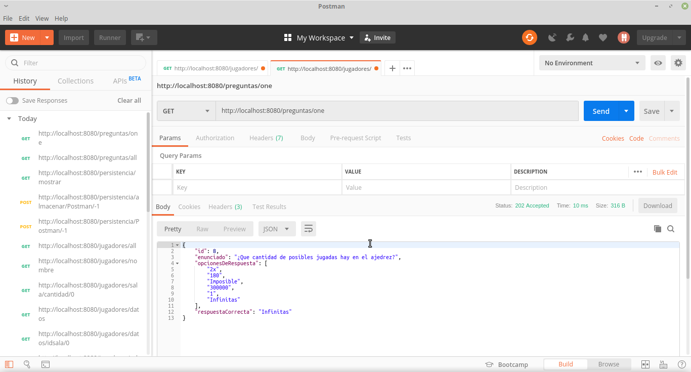

---
- Nos regresa una baraja de cartas con una configuracion deacuerdo al nivel 
que se le pase como parametro.

- Nivel 1

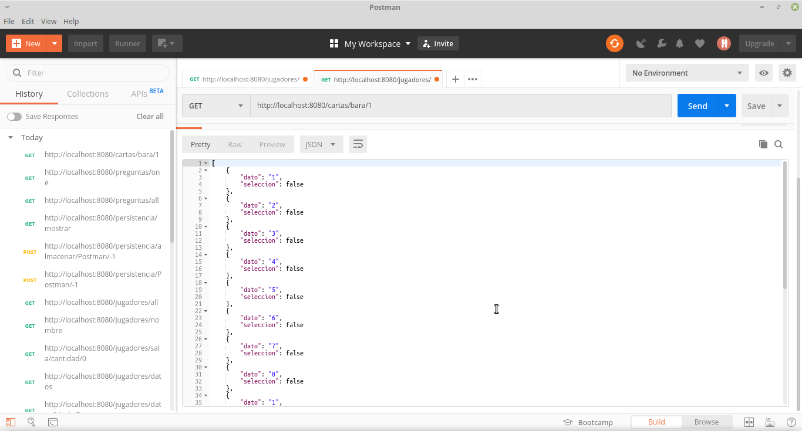

- Nivel 2
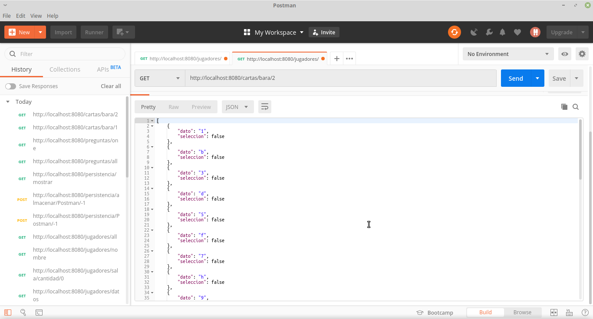

- NIvel 3

---

### :triangular_ruler: Diseño de arquitectura 
#### - Paquetes

#### - Clases

#### - Paquete Detalle 1

#### - Paquete Detalle 2

#### - Paquete Detalle 3

#### - Interaccion Stomp
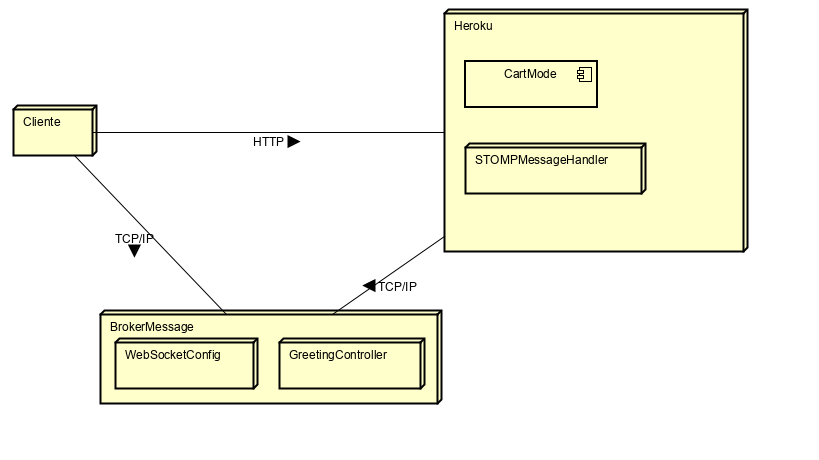
#### - Diagrama de Despliege
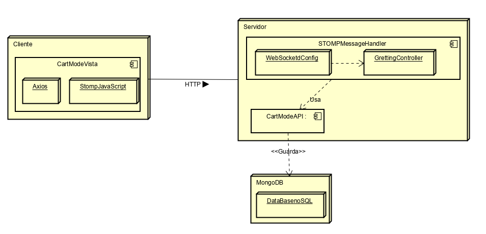

---
### :wrench: Tecnologías utilizadas

---
### Licencia
[MIT]()
