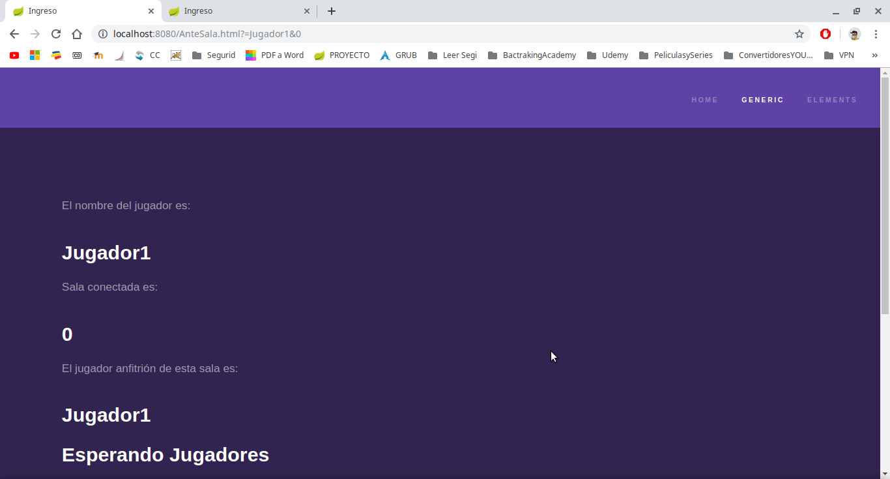
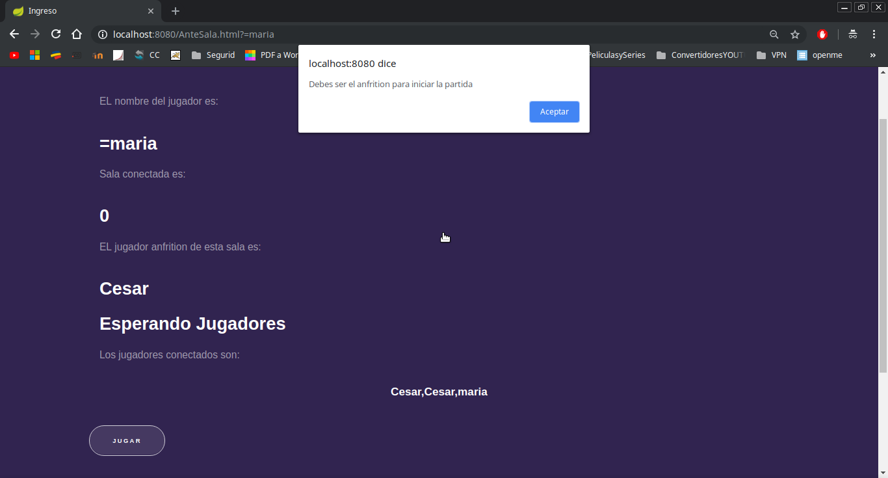
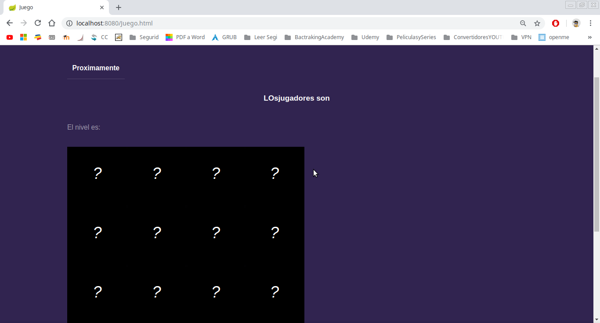
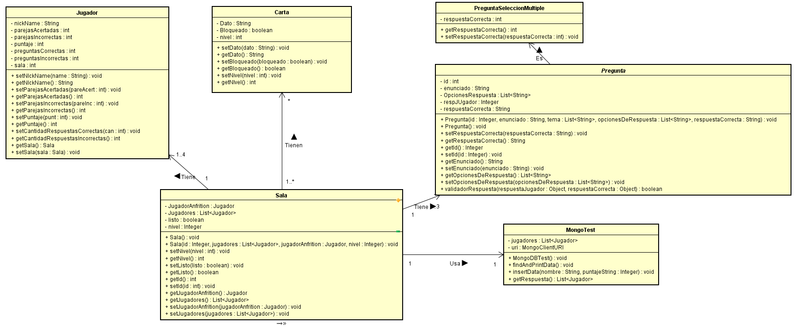
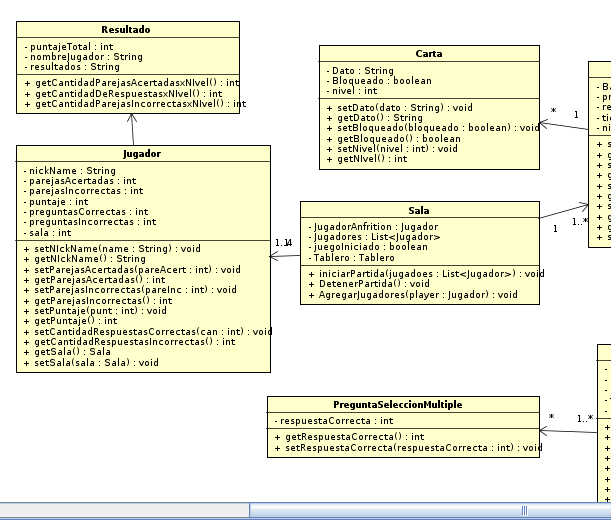
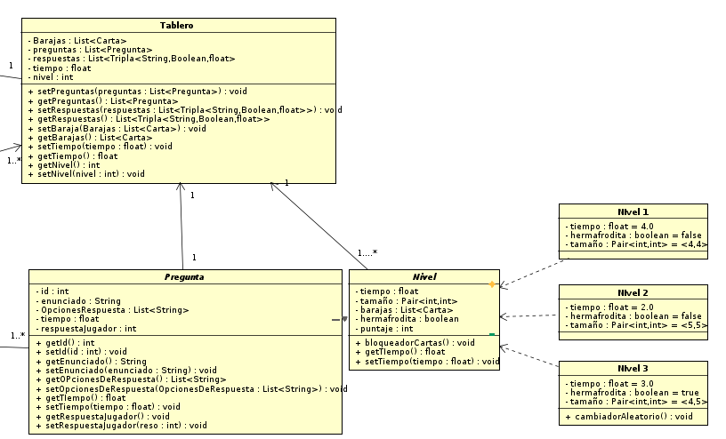

# CartMode

## Arquitecturas de Software (ARSW) 
## 2019-1 
## Escuela Colombiana de Ingeniería Julio Garavito - Ingeniería de Sistemas
#### Juego educativo, competitivo y a su vez de entretenimiento tipo seleccion de parejas que pretende poner a prueba las hablidades cognitivas de los usuarios, complementandolo con preguntas sencillas de matematicas..
---
### Integrantes
- Cesar E. Lanos Camacho
### Profesor
- David Saavedra
---
### :link: URLs
| Elemento | Link |
|:-------------------------------------:|:----------------------------------------------------------------------------------------------------:|
| Propuesta de proyecto | https://docs.google.com/document/d/1ynF7FltaMq4Is_eI6oozmRWI5bi-lQrzWnHo84oVVRc/edit?usp=sharing  |
| Taiga |  | https://tree.taiga.io/project/cefarr-cartmode/timeline
| NinjaMock |  |
| Backlog de producto |  |
| Javadoc | Generado en la ruta ./target/site/apidocs |
| Documento de Arquitectura del Sistema | | 
---
### :book: Instrucciones
Proximamente

---

### :camera: Pantallas de la aplicación-- Pruebas Funcionales.

### :book: Requisitos Funcionales

- El jugador inicia la aplicacion e ingresa a la pagina de bienvenida.

---

- El jugador se conecta y queda registrado en una sala unica.(De ser el primero queda como anfitrion).

---

- Cada jugador puede conocer tanto su anfitrion como los demas participantes de su partida.

---

- El Anfitrion es el unico que puede iniciar la partida.

---

---
-Como se observa maria ingreso a la sala de juego.

-Pero no puede iniciar la partida.
---

---

-Al iniciar la partida puede empezar a emparejar.

---

- Los jugadores pueden empezar a escoger cartas.

---

- Proximamente

---

- Proximamente

---

- Proximamente

---

- Proximamente

---

---

---

---

---

### :triangular_ruler: Diseño de arquitectura 
#### - Paquetes

#### - Clases

#### - Clases Detalle 1

#### - Clases Detalle 2

#### - Componente Conector

#### - Interaccion Stomp

#### - Diagrama de Despliege

---
### :wrench: Tecnologías utilizadas

---
### Licencia
[MIT]()
